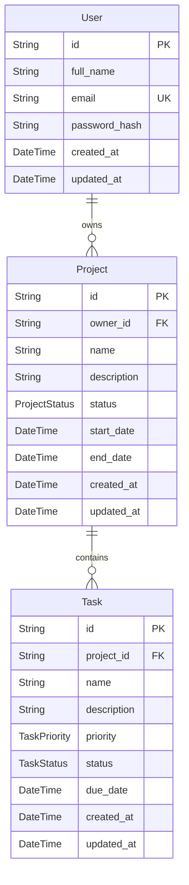

# Database ERD

```mermaid
erDiagram
    User {
        String id PK
        String full_name
        String email UK
        String password_hash
        DateTime created_at
        DateTime updated_at
    }

    Project {
        String id PK
        String owner_id FK
        String name
        String description
        ProjectStatus status
        DateTime start_date
        DateTime end_date
        DateTime created_at
        DateTime updated_at
    }

    Task {
        String id PK
        String project_id FK
        String name
        String description
        TaskPriority priority
        TaskStatus status
        DateTime due_date
        DateTime created_at
        DateTime updated_at
    }

    User ||--o{ Project : "owns"
    Project ||--o{ Task : "contains"
```
